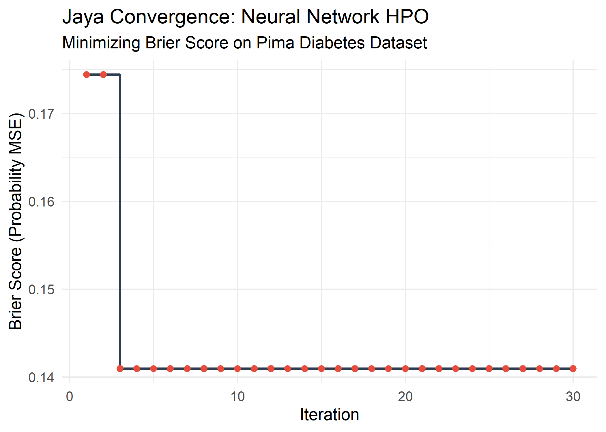

GSoC 2026 Easy Test: Neural Network Hyperparameter Optimization
================
Pratik Bangerwa
2026-03-12

## 1. Introduction

This document addresses the “Easy Test” for the **Jaya for Modern
Hyperparameter Optimization** GSoC 2026 project.

Decision Trees often have discrete, step-like loss landscapes that
obscure the continuous optimization process. To better demonstrate
Jaya’s ability to navigate a smooth, mixed-type search space, we
optimize a **Single-Hidden-Layer Neural Network** (`nnet`) on the `Pima`
diabetes dataset.

We simultaneously optimize two hyperparameters:

- `size` — Number of hidden neurons (Integer: 1 to 20)
- `decay` — Weight decay regularization (Continuous: 0.0001 to 0.1,
  log-scale)

## 2. Data Preparation

We use the `Pima.tr` and `Pima.te` datasets from the `MASS` package with
strict train/test isolation.

``` r
library(MASS)
data(Pima.tr)
data(Pima.te)

train_data <- Pima.tr
test_data  <- Pima.te

# Convert target to numeric (0/1) for probability-based scoring
actual_test_numeric <- ifelse(test_data$type == "Yes", 1, 0)
```

## 3. The Objective Function

The objective function receives Jaya’s raw continuous vector and decodes
it into valid hyperparameters before training.

`size` is an integer parameter and is decoded using the floor-based
formula with a +0.999 offset, which ensures uniform sampling probability
across all integer values in \[1, 20\]. Using `round()` would assign
half the probability mass to the endpoints (1 and 20) compared to
interior values, which biases the search.

`decay` spans three orders of magnitude (0.0001 to 0.1), so it is
decoded on a log scale. A linear decode would spend the majority of the
search budget in the upper range (0.05 to 0.1) and severely
under-explore the lower, more sensitive region.

Rather than flat classification accuracy, we use the **Brier Score (Mean
Squared Error of Probabilities)** as the objective. This provides a
smooth, continuous signal: every adjustment Jaya makes to `decay`
produces a measurable change in the score, giving the optimizer a
well-defined surface to descend.

The random seed is set **once before calling `jaya()`**, not inside the
objective function. Fixing a seed inside the objective would freeze
every neural network to the same initialization regardless of its
hyperparameters, artificially smoothing the loss surface and producing
misleading results.

``` r
library(nnet)

eval_nn <- function(x) {
  # Decode size: floor-based integer decoding with uniform bucket widths
  p_size <- floor(1 + x[1] * (20 - 1 + 0.999))
  p_size <- max(1L, min(p_size, 20L))

  # Decode decay: log-scale for parameters spanning multiple orders of magnitude
  p_decay <- exp(log(0.0001) + x[2] * (log(0.1) - log(0.0001)))
  p_decay <- max(0.0001, min(p_decay, 0.1))

  # Train the neural network
  model <- nnet(
    type ~ .,
    data  = train_data,
    size  = p_size,
    decay = p_decay,
    trace = FALSE
  )

  # Predict probabilities
  preds <- predict(model, test_data, type = "raw")

  # Brier Score: continuous, smooth signal for the optimizer
  mse <- mean((preds - actual_test_numeric)^2)

  return(mse)
}
```

## 4. Running the Jaya Algorithm

We pass a normalized internal search space of $[0,1]^2$ to Jaya. All
decoding from the internal representation to valid hyperparameters
happens inside `eval_nn`. The seed is set here, once, before the
optimization run begins.

``` r
library(Jaya)

# Internal search space: [0, 1]^2
# Decoding to actual parameter ranges happens inside eval_nn
lower_bounds <- c(0, 0)
upper_bounds <- c(1, 1)

set.seed(123)
jaya_results <- jaya(
  fun     = eval_nn,
  lower   = lower_bounds,
  upper   = upper_bounds,
  popSize = 8,
  maxiter = 30,
  n_var   = 2
)
```

## 5. Results & Convergence Visualization

Extract and decode the best configuration found.

``` r
best_raw   <- as.numeric(jaya_results$Best[1:2])

best_size  <- floor(1 + best_raw[1] * (20 - 1 + 0.999))
best_size  <- max(1L, min(best_size, 20L))

best_decay <- exp(log(0.0001) + best_raw[2] * (log(0.1) - log(0.0001)))
best_decay <- max(0.0001, min(best_decay, 0.1))

best_mse   <- as.numeric(jaya_results$Best[3])

cat("Optimized Hidden Neurons (Integer):", best_size, "\n")
```

    ## Optimized Hidden Neurons (Integer): 1

``` r
cat("Optimized Weight Decay (Continuous):", format(best_decay, scientific = FALSE), "\n")
```

    ## Optimized Weight Decay (Continuous): 0.1

``` r
cat("Best Probability MSE:", best_mse, "\n")
```

    ## Best Probability MSE: 0.1409495

The convergence plot below shows Jaya navigating the neural network loss
surface across iterations, stepping out of suboptimal configurations and
driving the Brier Score downward.

``` r
library(ggplot2)

history_df <- data.frame(
  Iteration  = seq_along(jaya_results$Iterations),
  Best_Error = jaya_results$Iterations
)

ggplot(history_df, aes(x = Iteration, y = Best_Error)) +
  geom_step(color = "#2c3e50", linewidth = 1) +
  geom_point(color = "#e74c3c", size = 2) +
  theme_minimal(base_size = 14) +
  labs(
    title    = "Jaya Convergence: Neural Network HPO",
    subtitle = "Minimizing Brier Score on Pima Diabetes Dataset",
    x        = "Iteration",
    y        = "Brier Score (Probability MSE)"
  )
```

<!-- -->
