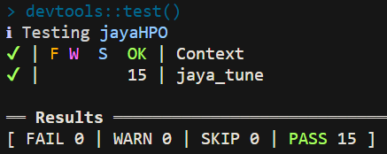
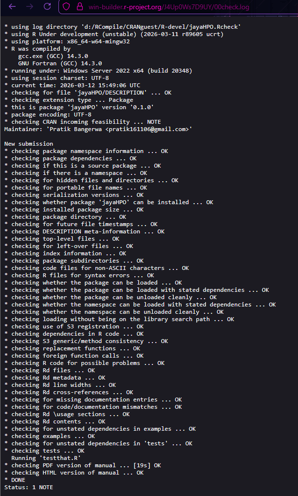
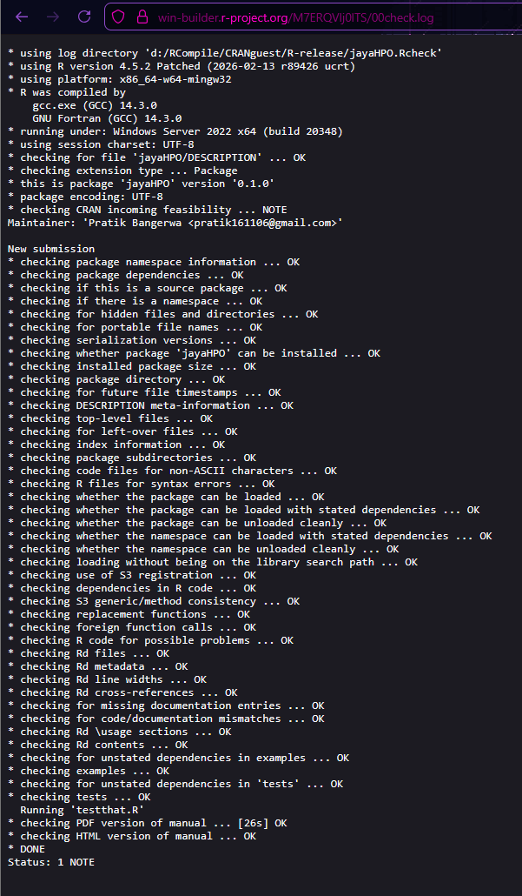

# jayaHPO — Hard Test Submission

**Applicant:** Pratik Bangerwa  
**Email:** pratik161106@gmail.com  
**Test:** Hard Test — GSoC 2026: Jaya for Modern Hyperparameter Optimization

## Overview

[`jayaHPO`](https://github.com/delta17920/r/tree/main/Harddd/jayaHPO) is a minimal R package implementing `jaya_tune()`, a hyperparameter optimization function built on the Jaya algorithm. It supports mixed-type parameter spaces (continuous, integer, and categorical) via an encoding-decoding layer, and internally operates on a normalized `[0,1]^D` search space consistent with the design proposed in the Medium Test.

The package fulfills all Hard Test requirements:

- Accepts a user-defined evaluation function via a structured `param_space` definition
- Handles integer parameters correctly using floor-based decoding with uniform bucket widths
- Includes 15 unit tests via `testthat` covering all parameter types and edge cases
- Builds successfully on win-builder (R-devel and R-release) with 0 errors and 0 warnings

## Files

| File | Description |
|------|-------------|
| [`jayaHPO/R/jaya_tune.R`](https://github.com/delta17920/r/blob/main/Harddd/jayaHPO/R/jaya_tune.R) | Core implementation |
| [`jayaHPO/tests/testthat/test-jaya_tune.R`](https://github.com/delta17920/r/blob/main/Harddd/jayaHPO/tests/testthat/test-jaya_tune.R) | Unit tests |
| [`jayaHPO/DESCRIPTION`](https://github.com/delta17920/r/blob/main/Harddd/jayaHPO/DESCRIPTION) | Package metadata |
| [`jayaHPO/man/jaya_tune.Rd`](https://github.com/delta17920/r/blob/main/Harddd/jayaHPO/man/jaya_tune.Rd) | Generated documentation |
| [`jayaHPO/proof/`](https://github.com/delta17920/r/tree/main/Harddd/jayaHPO/proof) | Win-builder and test screenshots |

## Usage

```r
library(jayaHPO)

param_space <- list(
  list(name = "lr",        type = "continuous",  lower = 0.0001, upper = 0.1, scale = "log"),
  list(name = "max_depth", type = "integer",      lower = 1,      upper = 10),
  list(name = "kernel",    type = "categorical",  categories = c("linear", "poly", "rbf"))
)

result <- jaya_tune(
  fn          = function(p) (p$lr - 0.01)^2 + (p$max_depth - 5)^2,
  param_space = param_space,
  pop_size    = 10,
  max_iter    = 30,
  seed        = 42
)

result$best_params
result$best_score
result$history     # best score at each iteration for convergence plotting
```

## Design

All three GSoC tests share a consistent internal architecture. Jaya always operates on a normalized `[0,1]^D` search space. Decoding to valid hyperparameters happens via a type-specific layer before each evaluation:

```
Jaya Optimizer
      │
      ▼
Continuous Vector [0,1]^D
      │
      ▼
Boundary Clamp  ←── pmin / pmax
      │
      ▼
Encoding-Decoding Layer
  ├── Continuous  (linear / log scale)
  ├── Integer     (floor + 0.999 offset)
  └── Categorical (binned indexing)
      │
      ▼
Valid Hyperparameters → Objective Function → Score → Jaya Update
```

### Integer Decoding

Integer parameters use the floor-based formula with a +0.999 offset:

$$\text{value} = \left\lfloor \text{lower} + x \cdot (\text{upper} - \text{lower} + 0.999) \right\rfloor$$

This guarantees every integer in `[lower, upper]` gets an equal-width bucket in `[0,1]`. Using `round()` instead would assign half the probability mass to the endpoints compared to interior values, biasing the search away from boundary integers like depth=1 or depth=10.

### Log-Scale Decoding

Parameters like learning rate span multiple orders of magnitude (e.g. 0.0001 to 0.1). A linear decode would spend most evaluations in the upper range and barely explore the sensitive lower region. Log-scale decoding fixes this:

$$\text{value} = \exp\!\Big(\log(\text{lower}) + x \cdot \big(\log(\text{upper}) - \log(\text{lower})\big)\Big)$$

### Categorical Decoding

Safe 1-indexed binning consistent with R conventions, with an explicit guard against the `x = 1.0` edge case:

```r
idx <- min(floor(x * N) + 1L, N)
```

### Normalized Internal Space

Passing `[0,1]^D` to Jaya rather than raw parameter bounds prevents large-range parameters from dominating the update step, simplifies boundary handling, and keeps the encoding-decoding logic self-contained inside `jaya_tune()`.

## Parameter Types Supported

| Type | Example Parameters | Decoding |
|------|--------------------|---------|
| Continuous (linear) | regularization strength | `lower + x * (upper - lower)` |
| Continuous (log-scale) | learning rate, weight decay | `exp(log(lower) + x * (log(upper) - log(lower)))` |
| Integer | tree depth, hidden neurons, mtry | `floor(lower + x * (upper - lower + 0.999))` |
| Categorical | kernel type, activation function | `categories[min(floor(x * N) + 1, N)]` |

## Unit Tests

15 tests via `testthat` covering:

- Return structure (`best_params`, `best_score`, `history` all present and correct types)
- Integer decoding correctness — decoded value equals `floor()` of itself, always within `[lower, upper]`
- Categorical decoding — returned value always belongs to the defined category set
- Log-scale continuous — decoded value always within `[lower, upper]` across random inputs
- Input validation — informative errors on bad `fn`, empty `param_space`, `pop_size < 2`
- Boundary clamp — values outside `[0,1]` are clamped, not crashed on

## Build Verification

### testthat — 15 tests, 0 failures

All 15 tests pass locally across all parameter types and edge cases.



### Win-builder R-devel

Checked against R Under development (unstable) `2026-03-11 r89605` on Windows Server 2022 x64 via `win-builder.r-project.org`.

Every check returned `OK`. Tests ran successfully on win-builder's Windows environment (`Running 'testthat.R'` — OK).

**Status: 1 NOTE**

The single note reads:

```
* checking CRAN incoming feasibility ... NOTE
Maintainer: 'Pratik Bangerwa <pratik161106@gmail.com>'

New submission
```

This note is **automatically generated for every package that has never been submitted to CRAN before**. It is not a code issue, not a warning, and not fixable — it will disappear permanently after the first accepted CRAN submission. CRAN policy explicitly exempts this note from causing rejection. No errors, no warnings.



### Win-builder R-release

Checked against R version `4.5.2 Patched (2026-02-13 r89426)` on Windows Server 2022 x64.

Every check returned `OK`. Tests ran successfully (`Running 'testthat.R'` — OK). PDF and HTML manual both built cleanly.

**Status: 1 NOTE** — same "New submission" note as above, same explanation applies.



## File Structure

```
Harddd/
├── README.md          ← this file
└── jayaHPO/
    ├── .gitignore
    ├── .Rbuildignore
    ├── DESCRIPTION
    ├── NAMESPACE
    ├── R/
    │   └── jaya_tune.R
    ├── inst/
    │   └── WORDLIST
    ├── man/
    │   └── jaya_tune.Rd
    ├── proof/
    │   ├── tests_passing.png
    │   ├── winbuilder_devel.png
    │   └── winbuilder_release.png
    └── tests/
        ├── testthat.R
        └── testthat/
            └── test-jaya_tune.R
```
